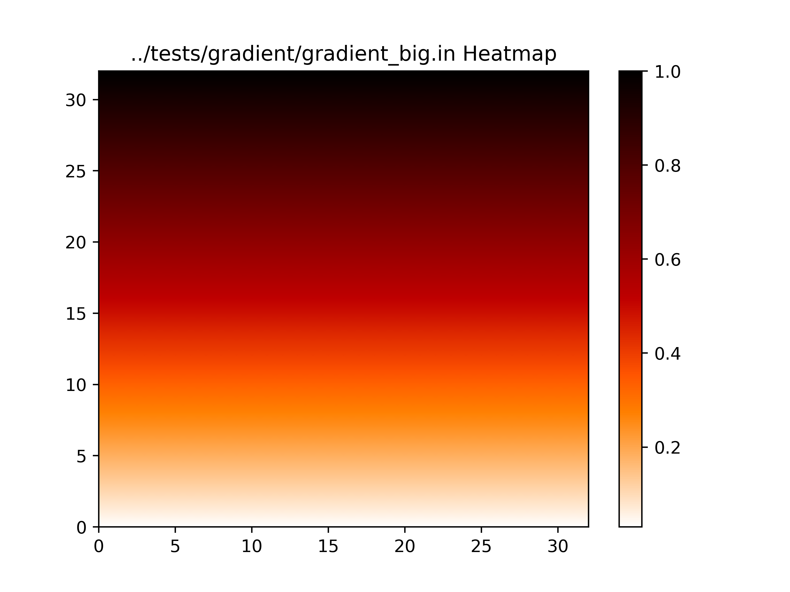
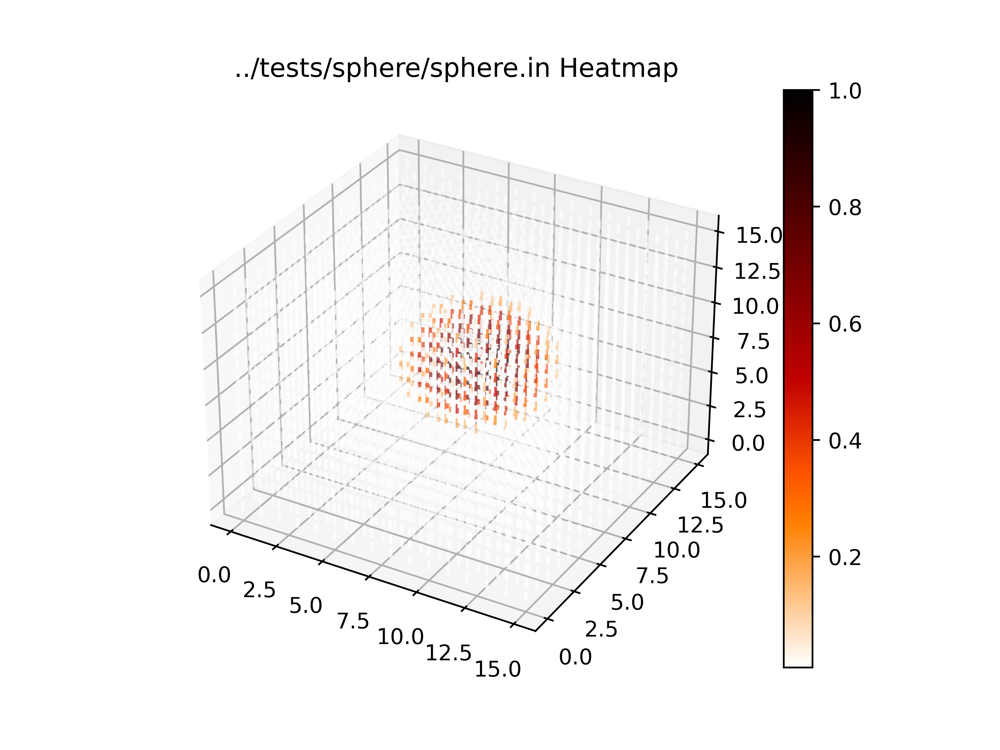
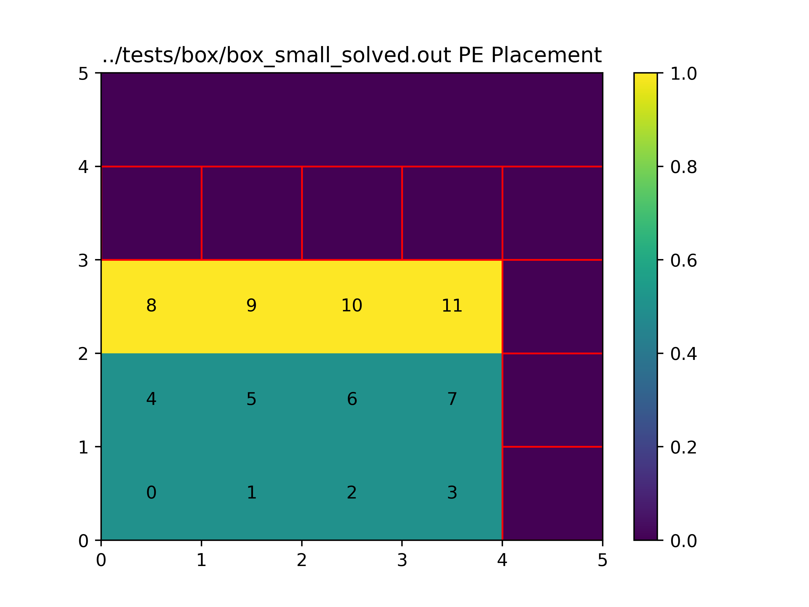
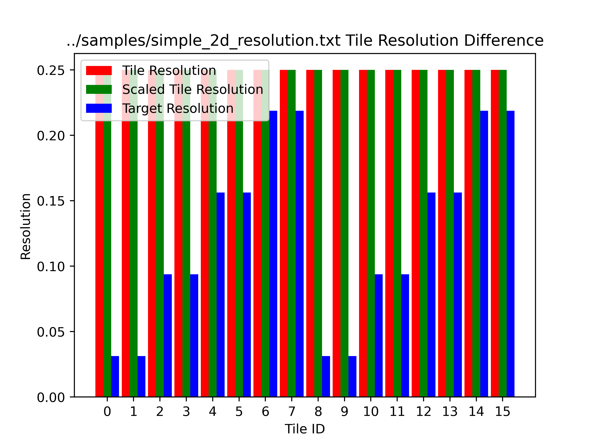

# 2021 ISPD Contest Validator/Scorer
This readme documents information regarding the validator/scorer which will be used for the 2021 ISPD Contest problem: Wafer-Scale Physics Modelling

## Folder Breakdown

The directory structure is as follows:
- `ispd2021`: Root folder
    - `docs`: Folder for documentation and related files
        - `schema.in`: File format explaination for problem input
        - `schema.out`: File format explaination for solution input
    - `Makefile`: Makefile for compiling validator
    - `test.sh`: Script to run test suites and test cases
    - `test_gen`: Folder containing scripts to generate test cases
    - `tests`: Folder containing test suites and test cases
        - `2d`: 2D tests
        - `3d`: 3D tests
    - `tools`: Folder containing tools to help visualize problem defintions and solutions
        - `requirements.txt`: Requirements for running visualization tools
        - `visualize_placements.py`: Visualize a solution's placement of tiles on the fabric
        - `visualize_heatmap.py`: Visualize a problem's defined heatmap
        - `visualize_resolution_diff.py`: Visualize the solution resolution, scaled solution resolution and tile resolution per tile
    - `README.md`: This README file
    - `validator`: Folder for validator source code
        - `ispd_validate.h`: Header file containing problem and solution declarations
        - `ispd_validate.c`: Source code for validator/solver
        - `util.h`: Header file with dependencies and useful macros
## Key Terms
- Tile: A section of space that corresponds to a single processor.
- Heatmap Space: Coordinate system using Cartesian axes, where the unit step is `1.0 / volume`. This is the coordinate system that heatmap points use.
- Sampling Space: Coordinate system using Cartesian axes, where the unit step is `1.0 / (volume * inverse_sampling_step)`. This is the coordinate system that prism and tile positions use.
- Prism: A rectangular volume of space defined in the solution.
    - Resolution: A inverse logarithmic representation of the prism resolution.
        - Assuming a max resolution of 1.0, can solve for the actual resolution using `1.0 / (2 ^ resolution)`.
    - Origin: Defines the position of the lower bound corner of a prism in sampling space.
    - Shape: Defines dimensions of prism in size of tiles.
- Tile ID: ID of a tile, based off of the ordering of prisms in the solution and the size of each prism. See the source code for how it is computed.

## Building the Executable
Run `make` in the root folder `ispd2021`. This will build the executable in `out` directory. An alternative is to run `gcc -std=c11 -Wall -O2 ispd_validate.c -o ispd_validate -lm` in the folder `validator`.

## Running the Executable
After building the executable using `make` or manually, it can be run as follows

```
$ ./ispd_validate <testdata.in> [flags] < <team_output.out>
```

- `testdata.in`: Indicates the path to a file containing the problem definition (`*.in` files)
- `flags`: Optional flag parameters to enable
    - `-d`: Enable debug information regarding parsed problem/solution and spatial trees built
    - `-c`: Enable connectivity information between adjacent tiles in solution
    - `-r`: Enable information regarding target and solution resolutions per tile
    - `-s`: Enable information regarding scoring results
    - `-o dir`: Specify a `dir` directory where to write feedback to (i.e. `score.txt`)
        - If not enabled, the current directory is used for feedback
- `team_output.out`: Indicates the path to a file containing the problem solution (`*.out` files)

If everything is validated, the program should output the following
```
[X] - Overlap Validated
[X] - Coverage Validated
[X] - Connectivity Validated
[X] - PE Fit Validated
```
as well as a computed score for the accuracy and wire placement. The final score will be written to `score.txt` in the feedback directory

If validation failed, scoring will not occur, but instead the executable will return with exit code 1 as well as a error message based on what failed.

### Finding Adapters
When the number of adapters in the solution adapter map (see [below](###Problem-Solution)) is not equal to the number of adapters required by the solution, the validator will output a table of connections which require adapters. This table has three columns refering to the current tile, the face of the current tile for this connection, and the adjacent tile. This list is sorted in ascending order of current tile ID, face ID and adjacent tile ID.

## Testing the Executable
Tests are arranged in the `tests` folders into various subfolders which designate a test suite. The name of the test suite is the name of the folder. Inside the test suite are test cases which are seperated by file name. Each test case has a `.in` and a `.out` file corresponding to the test problem and solution respectively. 2D and 3D tests of the same suite are seperated into two folders `2d` and `3d` based on the dimension of each test problem.
The `test.sh` script can be used to run the various test suites/cases in the `tests` folder. It is called as follows
```
$ ./test.sh <validator> <feedback_dir> <suite> [test_case [additional_args]]
```
- `validator`: Indicates path to validator executable
- `feedback_dir`: Indicates feedback directory which is passed to validator executable
- `suite`: Indicates which folder of tests should be run, (e.g. `box` to run all tests in the `tests/box` folder).
    - If `all` is specified, it will run all tests
- `test_case`: Optional argument to specify which test case to run, (e.g. `box_small` to run only the `box_small` test using `box_small.in` and `box_small.out` as problem and solution respectively).
    - If no test case is specified or `all` is specified, it will run all test cases in the `suite`.
    - Can only be used when `all` is not specified for the `suite`.
- `additional_args`: Additional command line arguments to be forwarded to the validator (i.e. `-d` debug flag)
### Available Test Suites
- `box`: Models a dense box in the middle of a low density space
    - `box_big`: Large 3D rectangular prism with no adapters
    - `box_small`: Small 2D box with no adapters
    - `box_small_solved`: Small 2D box with valid solution (adapters included)
- `circle`: Models a 2D circle
    - `circle`: 2D circle with no adapters
- `flat`: Models a uniform space
    - `flat_big`: Large 3D uniform space
    - `flat_small`: Small 2D uniform space solved with several prisms
    - `flat_small_2`: Small 2D uniform space solved with one prism
- `gradient`: Models a linear gradient
    - `gradient_big`: Large 2D linear gradient 
    - `gradient_small`: Small 2D linear gradient
- `hollow_sphere`: Models a hollow sphere
    - `hollow_sphere-100`: Hollow sphere with dimensions 100x100x100
- `mix`: Set of tests modeling a small 2D linear gradient with different solutions
    - `flat_gradient`: Flat solution to problem
    - `gradient_gradient`: Gradient solution to problem
- `overlap`: Set of tests checking for invalid solutions that overlap
    - `overlap_3d`: Tests overlap in 3D
    - `overlap_flat`: Tests overlap of prisms of same resolution
    - `overlap_gradient`: Tests overlap of prisms of different resolution
- `simple`: Set of simple tests that are easy to visualize
    - `simple_2d`: Simple 2D test
    - `simple_3d`: Simple 3D test
- `sphere`: Models a 3D sphere
    - `sphere`: 3D sphere with no adapters
- `torus`: Models a 3D torus
    - `torus-200`: A torus with dimensions 400x400x200
## File Formats
There are two file formats which are important. Problem definitions use the `schema.in` format. Problem solutions us the `schema.out` format. Both allow for commenting out lines using a
`#` at the beginning of the line being commented out.
### Problem Definition
The following definition assumes no commented lines.
- Line 1: Dimension of the problem, can be 2 or 3
- Line 2: Volume of the space modelled.
    - For 2D spaces, this is two positive integers
    - For 3D spaces, this is three positive integers
- Line 3: Fabric dimensions which define the length and width of the processor board (two positive integers)
- Line 4: Cost parameters (two floating point values)
    - These two parameters make up the coefficients in the linear combination of the two score metrics. This gives us the final score of `alpha * accuracy_score + beta * placement_score` where `alpha` and `beta` are the cost parameters
- The rest of the lines contain floating point values which indicate values of a heatmap
    - Values are in the range [0, 1]
    - Heatmap is assumed to be a flat array of size one bigger than the size of the space volume
        - For 2D this is `(vol_length + 1) * (vol_width + 1)`
        - For 3D this is `(vol_length + 1) * (vol_width + 1) + (vol_height + 1)`
    - Heatmap is filled in by x then y then z
    - The max value across the entire heatmap must be 1.0
### Problem Solution
The following definition assumes no commented lines
- Line 1: Inverse sampling step (positive integer)
    - This represents the number of sampling steps that a single unit of volume from the problem definition is divided into.
    - For example, given a 2x2x2 volume and an inverse sampling step of 2. This means that in the sampling space, the sampling points take up a 4x4x4 volume where each unit is equivalent to 0.5 units of the problem volume.
- Line 2 to X - 1: Each line defines a prism
    - Each line starts with a non-negative integer representing the resolution in the inverse logarithmic scale
    - For 2D points it is followed by two non-negative integers for the origin of the prism and two
    positive integers for the shape of the prism in tiles
    - For 3D points it is followed by three non-negative integers for the origin of the prism and three positive integers for the shape of the prism in tiles
    - The ordering of the prisms will determine the ordering of tile IDs later on
- Line X: This line should only be the text `compute_map:` which defines the end of the prism list and the start of the compute map
    - The compute map is used to map tiles used for computation in the solution to placements on the fabric
- Line X + 1 to Y - 1: The following lines define entries of the compute map
    - Each line is two positive integers representing a position on the fabric
    - The index of the tile map corresponds to the tile ID that it is related to
        - i.e. `compute_map[0]` will be the position of the tile ID of 0
- Line Y: This line should only be the text `adapter_map:` which defines the end of the compute map and the start of the adapter map
    - The adapter map is used to map tiles used for adapters in the solution to placements on the fabric
- Line Y + 1 to EOF: The following lines define entries of the adpater map
    - Each line is two positive integers representing a position on the fabric
    - The same adapter is used for all tiles that are adjacent to the same face
    - The index of the tile map corresponds to the index of the adapter list created when validating adapters, (see [above](###Finding-Adapters))

## Visualizations
The `tools` folder contains some Python scripts that one might find useful for visualizing problem definitions and solutions.
### Heatmap Visualization
The `visualize_heatmap.py` is useful for visualizing the heatmap given by the problem solution in 2D space or in 3D space. This program will produce an image of either a 2D heatmap or 3D scatterplot of coloured points based on the dimension of the problem. To run this program from the command line, use the following in the `tools` directory
```
$ python visualize_heatmap.py [-h] [-i] problem [-o output]
```
- `-h`: Output help information regarding script usage
- `problem`: Problem definition to visualize (`.in` file)
- `-i`: Optional flag to use Gouraud shading for 2D heatmap to better display gradient
    - If not specified, the heatmap is discrete
- `-o output`: Optional argument indicating the output file to write to 
    - Since `matplotlib` is used, the file extension matters, (i.e. `.png` will save a PNG, `.pdf` will save a PDF
    - Default is `out.png`

#### Examples
```
$ python visualize_heatmap.py -i ../tests/2d/gradient/gradient_big.in -o ../docs/gradient_big.png
```
will create an interpolated PNG 2D heatmap of the `gradient_big.in` test



```
$ python visualize_heatmap.py ../tests/3d/sphere/sphere.in -o ../docs/sphere.png
```
will create a PNG 3D heatmap of the `sphere.in` test.



### Placement Visualization
The `visualize_placement.py` is useful for visualizing the placement of compute tiles and adapter tiles of a solution onto the fabric, as well as the resolutions of each tile. The colour of the tile represents the resolution. A value of 0 indicates a unused tile. Adpater tiles are indicted by squares outlined in red. For placements of less than 400 will also have the compute tiles labeled by tile ID. To run this program from the command line, use the following in the `tools` directory
```
$ python visualize_placement.py [-h] problem solution [-o output]
```
- `-h`: Output help information regarding script usage
- `problem`: Problem definition (`.in` file)
- `solution`: Solution placement to visualize (`.out` file)
- `-o output`: Optional argument indicating the output file to write to 
    - Since `matplotlib` is used, the file extension matters, (i.e. `.png` will save a PNG, `.pdf` will save a PDF
    - Default is `out.png`

#### Example
```
$ python visualize_placements.py ../tests/2d/box/box_small_solved.in ../tests/2d/box/box_small_solved.out -o ../docs/box_small_placement.png
```
will visualize the placements of the `box_small_solved.in` test.



### Resolution Visualization
The `visualize_resolution_diff.py` is useful for visualizing the solution, scaled and target resolutions per tile volume which are used to compute the accuracy score metric. The image produced gives the solution, scaled and target resolutions ordered by tile ID. This tool relies on output producted by the `validate` executable. One must run the `validate` executable on problem and solution with the `-r` flage and pipe the output to a file. This file is used as input to the tool. To run this program from the command line, use the following in the `tools` directory
```
$ python visualize_resolution_diff.py [-h] data [-o output]
```
- `-h`: Output help information regarding script usage
- `data`: Output from validator using `-r` flag
- `-o output`: Optional argument indicating the output file to write to 
    - Since `matplotlib` is used, the file extension matters, (i.e. `.png` will save a PNG, `.pdf` will save a PDF
    - Default is `out.png`

#### Example
```
$ ../out/ispd_validate ../tests/2d/simple/simple_2d.in . .. -r < ../tests/2d/simple/simple_2d.out > ../docs/simple_2d_resolution.txt
$ python visualize_resolution_diff.py ../docs/simple_2d_resolution.txt -o ../docs/simple_2d_resolution.png
```
will visualize the resolution values of the `simple_2d.in` test.


